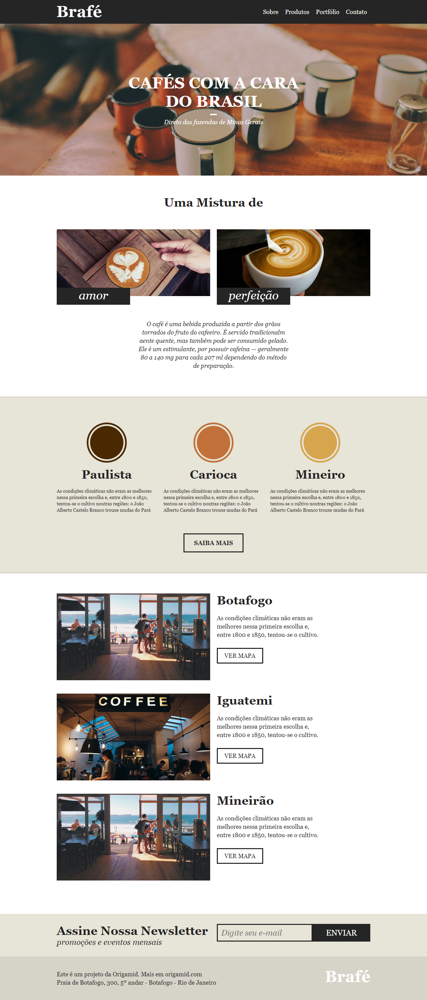

# Brafe
Site de Café 
Projeto Criado no curso de Web Design da Origamid
<h1 align="center">
  
</h1>
<h4 align="center"> 
	🚧  Brafe 🚀 Concluído  🚧
</h4>

## Sobre o projeto

Bikcraft - é um site de venda de bicicletas sobe medida.

Projeto desenvolvido durante curso de Web Design da Origamid

##  Telas

- [x] Home

## Web
<h1 align="left">
  
 
  </h1>

## Mobile

<h1 align="left">
  
  
  
   </h1>
  
## Tecnologias
 
- [HTML5](https://www.w3schools.com/html/default.asp)
- [CSS3](https://www.w3schools.com/w3css/w3css_cards.asp)

## Licença
Este projeto pode ser usado por qualquer pessoa! Licença MIT
